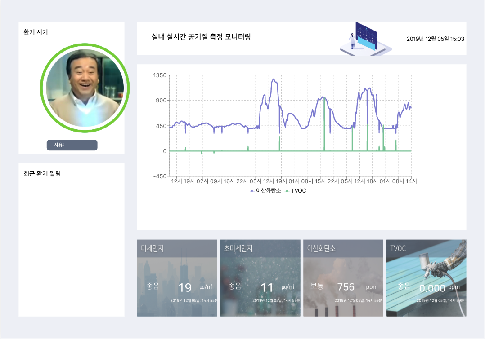
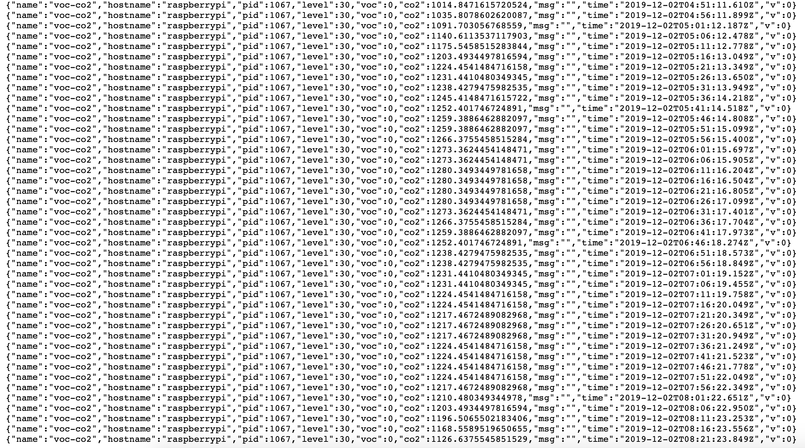
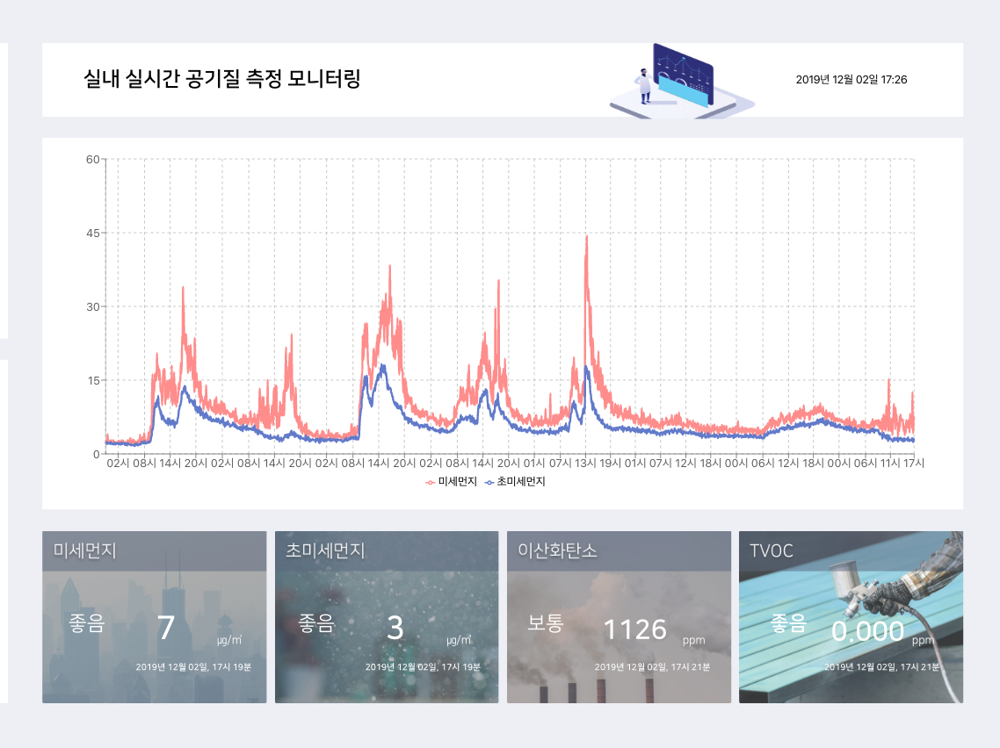
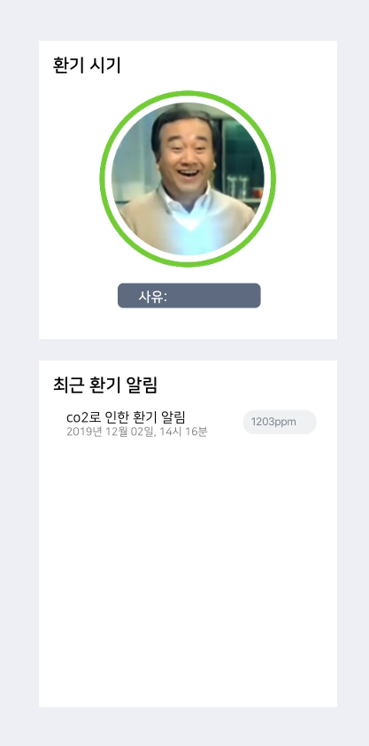

<br>
<br>

# 개요

<br>

대한민국 전역이 중국에서 넘어오는 미세먼지로 인해 고역을 치룰 때 **실외**는 곳곳에 미세먼지수치를 알려주는 컨텐츠가 많아서 손쉽게 오염정도를 파악할 수 있었으나 **실내 수치**는 알 도리가 없었다. 이에 *실내 오염수치(미세먼지, 초미세먼지, 이산화탄소, TVOC)를 파악하고* 평균 수치를 넘어서 높게 측정이 되면 환기 시점을 알려주는 웹을 만들게 되었다.

<br>
<br>

# 기획

<br>

* **라즈베리파이**를 이용하여 미세먼지, 초미세먼지, 이산화탄소, TVOC를 측정하고 수치를 json형태로 서버에 저장한다.

<br>

   미세먼지/초미세먼지 : http://192.168.0.31/aqi.json </br>
   이산화탄소/TVOC : http://192.168.0.31/voc-co2.json
   ***
   
   
<br>

* **React.js**를 이용하여 반응형으로 화면을 만들고 서버에서 수치들을 받아와 파싱하여 활용한다.

<br>


* **메인에는 chart**로 한 달 단위로 쌓인 수치를 모두 보여주며 하단에는 가장 최근 수치를 보여준다.

<br>



<br>

* **사이드에는** 오염수치일 경우 환기가 필요하다는 이미지와 어떠한 사유인지 알려주도록 하고 최근 환기 알림에 일정 시간동안 보여준다.

<br>


    
<br>   
<br>   

# 기술 설계

<br>

* **create-react-app 폴더명**을 통해 작업환경이 준비가 되어있는 상태로 시작한다.이는 facebook에서 관리하는 React Boilerplate code이다. 따로 Boilerplate를 만들어 사용할 경우 버전 관리 및 업데이트에서 시간을 많이 소모해야되고 번거롭다. 당장에 **webpack, babel**은 리엑트를 할 때에 필요한 요소이기에 포함해야 되는데 이들을 세팅하는 일이 엄청 복잡하다. 하지만 **create-react-app** 명령어 하나면 모든게 해결된다.

```renux
    create-react-app finedustcheck
```
***
* **데이터 파싱**을 위해 서버에서 json형태로 저장된 데이터를 **fetch**로 받아서 작업을 하였다. 클라이언트에서 서버에 있는 데이터를 받아오는데 사용하는 API에는 대표적으로 **fetch와 axios**가 있다.
둘 다 Promise형태로 작성한다.

```renux
    npm install --save fetch
```
<br>

```jsx
    fetch('http://192.168.0.31/aqi.json')
        .then(res=>res.text())
        .then(res=>res.split('},'))
        .then(res=>res[res.length-2])
        .then(res=>this.setState({dustcontent : res}));

    fetch('http://192.168.0.31/voc-co2.json')
        .then(res=>res.text())
        .then(res=>res.split('\n'))
        .then(res=>res[res.length-2])
        .then(res=>this.setState({co2content : res}));
```
***

리엑트에는 **Lifecycle(생명주기)**를 가진다. 생명주기란 컴포넌트가 생성되고 사용되고 소멸되는 일련의 과정을 말한다.<br> 아래에 그림을 참고하여 설명을 이어서 하겠다.

**React Lifecycle 16.4**


그림과 같이 순서는 constructor -> render -> componentDidMount 순으로 **초기 마운트**가 되고 state나 props값이 업데이트될 때마다 render -> componentDidUpdate가 실행된다.마지막으로 컴포넌트가 제거될 때에는 componentWillUnMount함수가 실행된다.<br>

**라이프사이클함수**를 이용하여 실시간 chart 업데이트와 이벤트 등록 및 제거를 하였다.

```jsx
    let customInterval;

    constructor(props){
        super(props)
        //초기 fetch 업데이트
        fetch('http://192.168.0.31/aqi.json')
        .then(res=>res.text())
        .then(res=>res.split('},'))
        .then(res=>res[res.length-2])
        .then(res=>this.setState({dustcontent : res}));

        fetch('http://192.168.0.31/voc-co2.json')
        .then(res=>res.text())
        .then(res=>res.split('\n'))
        .then(res=>res[res.length-2])
        .then(res=>this.setState({co2content : res}));
    }

    componentDidMount(){
        //실시간 fetch 업데이트
    customInterval = setInterval(()=>{
            fetch('http://192.168.0.31/aqi.json')
            .then(res=>res.text())
            .then(res=>res.split('},'))
            .then(res=>res[res.length-2])
            .then(res=>this.setState({dustcontent : res}));
    
            fetch('http://192.168.0.31/voc-co2.json')
            .then(res=>res.text())
            .then(res=>res.split('\n'))
            .then(res=>res[res.length-2])
            .then(res=>this.setState({co2content : res}));
        },300000);
    }

    componentWillUnmount(){                                                          
        clearInterval(customInterval);
    }
```
<br>

**처음 render**가 되기 전에 Chart에 표시할 데이터를 서버에서 받아오는 작업을 **constructor**에서 한다. 한번 render가 되고 componentDidMount()에서 **setInterval(func, 시간)** *(는 func을 시간에 한번씩 반복실행하는 함수이다)* 비동기함수를 이용하여 5분에 한번씩 서버에서 데이터를 받아와 **Chart**를 업데이트해준다. 마지막으로 중복 실행을 막기 위해 componentWillUnMount()에서 setInterval를 제거해준다.

* **Rechart API**를 이용해서 차트를 구현하였다.

```renux
    npm install --save recharts
```
<br>

```jsx
    import {
    LineChart, Line, XAxis, YAxis, CartesianGrid, Tooltip, Legend,
  } from 'recharts';

  //recycle
  componentDidMount(){
      if(this.state.visible){
        cutomInterval = setInterval(()=>{
          this.setState({visible:!this.state.visible});
        },15000);
      }
      
      window.addEventListener('resize', this.updateWindowSize);
      window.addEventListener('resize', this.updateChartDimentsion);
  }

  componentWillUnMount(){
      window.removeEventListener('resize', this.updateWindowSize);
      window.removeEventListener('resize', this.updateChartDimentsion);
  }

    //차트크기변경함수
    updateChartDimentsion=()=>{
            if(1700<this.state.width){
            this.setState({chartWidth :this.state.width-450});
            }else if(1100<this.state.width<1700){
            this.setState({chartWidth :this.state.width-550});
            }
            if(this.state.width<1100){
            this.setState({chartWidth :this.state.width-400});
            }
        
            if(850<this.state.height)
            this.setState({chartHeight:this.state.height});
            else if(650<this.state.height<800)
            this.setState({chartHeight:this.state.height-400});

            if(this.state.height<650)
            this.setState({chartHeight:this.state.height-350});
    };

    //웹 사이즈 크기 변경시 변경값으로 state값 업데이트함수
    updateWindowSize=()=>{
        this.setState({width :window.innerWidth,
        height : window.innerHeight});  
    };

    <LineChart //선으로 그려진 차트
        width={this.state.chartWidth}
        height={this.state.chartHeight}
        data={changeChart[0]}
        margin={{
        top: 30, right: 30, left: 30, bottom: 0,
        }}
    
    > 
        <CartesianGrid strokeDasharray="4 4" /> //눈금 점선
        <XAxis dataKey="time"/> //x좌표 표시 데이터 : time기준
        <YAxis /> //y좌표
        <Legend /> //점마다 데이터정보 표시
        <Line type="monotone" dot={false} dataKey={changeChart[3]} stroke={changeChart[1]} strokeWidth={3}/> //데이터1 선 그리기
        <Line type="monotone" dot={false} dataKey={changeChart[4]} stroke={changeChart[2]} strokeWidth={3}/> //데이터2 선 그리기
    </LineChart>

```
* *주석을 모두 읽어주세요.* <br>

웹 창 사이즈가 변결될 때 그 값을 가져오는데 **addEventListener('resize')**를 사용하였다. 이 함수는 자바스크립트에서 기본으로 제공하는 이벤트함수이다. 
<br>

코드설명을 하자면 먼저 **컴포넌트가 초기 생성**될 때 componentDidMount()함수가 실행되고 여기서 하는 일은 **3가지**이다. **첫번째로** visible값을 15초에 한번씩 반전하여 15초는 미세먼지,초미세먼지 데이터를 차트에 표시하고 15초는 이산화탄소, TVOC를 차트에 표시한다. **두번째는** 웹 창 사이즈가 변경 시 그 값을 가져와 state에 width,height를 변경해주는 이벤트함수를 등록한다. **세번째는** 웹 창 사이즈에 따라 차트 크기를 변경해주는 이벤트함수를 등록한다. **updateWindowSize()**는 웹 사이즈 값을 state에 담는 기능을 하는 함수이고 **updateChartDimention()**는 변경 된 웹 사이즈에 따라 차트 크기 state값을 바꿔주는 기능을 하는 함수이다. 마지막으로 중복으로 이벤트가 발생하지 않게 **componenetWillUnMount()**에서 등록된 두개의 이벤트리스너를 없앤다.

<br>

**Rechart 링크: http://recharts.org/en-US/**

<br>

* 차트, 사이드 컴포넌트 생성 시 **animate**를 적용하였다.

```renux
    npm install --save react-animated-css
```
<br>

```jsx
    <Animated animationIn="zoomIn" animationOut="zoomOut" animationInDuration={800} 
        animationOutDuration={1000} isVisible={this.state.chartVisible}
    >

    //애니메이션 적용할 컴포넌트를 위치함.

    </Animated>
```
컴포넌트 생성 및 삭제시에 zoomIn, zoomOut 애니메이션을 사용하였다. 지속시간은 생성시에는 0.8초 삭제시에는 1초를 적용하였다. 최상단에 **Animated**태그가 위치해 있고 적용할 컴포넌트를 감싸주면 애니메이션이 적용된다.

**참고자료링크: https://github.com/digital-flowers/react-animated-css**

<br>

3. **Dependandies**
```jsx
    "dependencies": {
    "body-parser": "^1.19.0",
    "cross-env": "^5.2.0",
    "express": "^4.17.1",
    "immutable": "^4.0.0-rc.12",
    "moment": "^2.24.0",
    "moment-timezone": "^0.5.26",
    "react": "^16.9.0",
    "react-animated-css": "^1.2.1",
    "react-animation": "^1.2.0",
    "react-dom": "^16.9.0",
    "react-live-clock": "^3.1.0",
    "react-moment": "^0.9.2",
    "react-redux": "^7.1.0",
    "react-router-dom": "^5.0.1",
    "react-scripts": "3.1.1",
    "recharts": "^1.7.1"
  }
```

<br>

* ### Github 주소
**https://github.com/YooSeok2/fineDustCheck.git**

<br>

# 긴 글 읽어주셔서 감사합니다.          

