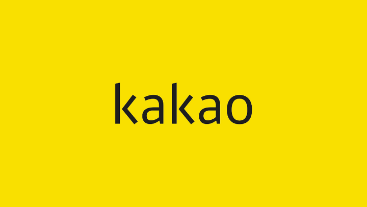
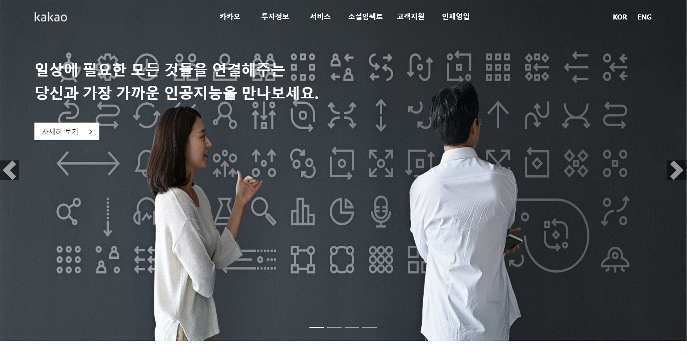
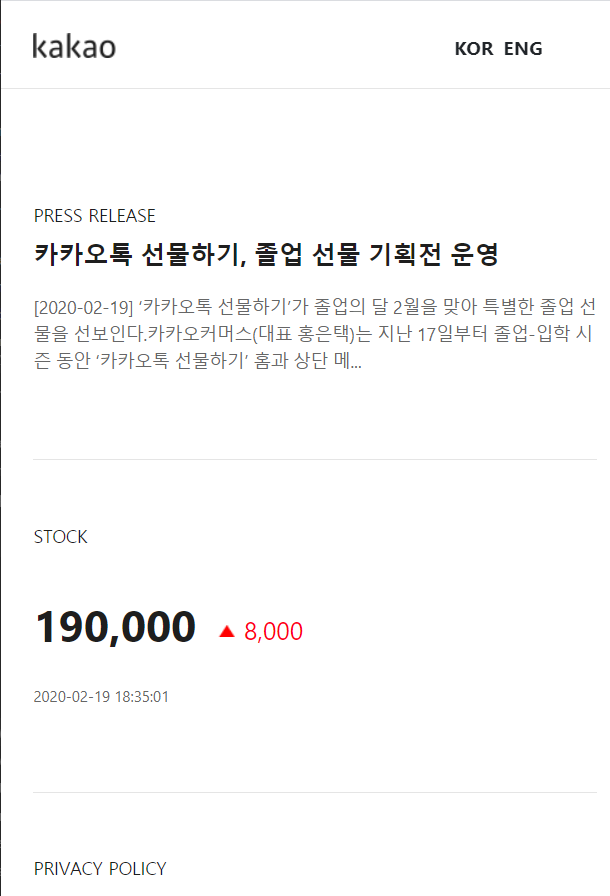

<br>
<br>

# 개요

<br>

>Vanila JS를 공부하고 이를 습득하기 위해 React.js를 이용한 카카오메인페이지 클론하는 프로젝트를 하다. 

요새 JavaScript 프론트엔드 라이브러리가 흥행하고 있습니다. 그 중에서도 3대장이라 불리우는 **Vue.js, Augular.js, React.js**는 혁신을 불러 일으키고 있는데 이 최신 동향에 발 맞추어 나 또한 3대장 중 **React.js를** 애용하고 있습니다. 이번에는 Vanila JS를 공부하기에 좋은 무료 강의자료가 있어서 쭉 진행하였고 무엇이든 만들어 보는것이 공부한 지식을 습득하는데에 가장 큰 도움이 된다고 생각하기에 카카오메인페이지를 만들었습니다.

<br>
<br>


# 기획

<br>

* **KaKao 메인화면**에 개발자코드를 참고하여 react를 사용해서 반응형으로 화면을 구현한다.



* **Mobile버전의 메인화면**을 구성한다.



<br>

* **실제 페이지에 적용된 동적인 기능**을 구현한다. 스크롤 시에 Header고정한다. 슬라이더는 react-bootstrap에서 제공하는 carousel 라이브러리를 이용하였다. Header 각 메뉴 동작 구현하였다.
<br>

**참고자료링크 : https://react-bootstrap.github.io/components/carousel/**</br>

* **구현 시 필요한 resources**는 해당 페이지 개발자 창에서 받아와 쓴다.

<br>
<br>

# 기술 설계
<br>
*생성 폴더 및 파일*<br>
-src<br>
--component<br>
---banner.js<br>
---footer.js<br>
---header.js<br>
---service.js<br>
---summary.js<br>
--images<br>
App.js<br>
App.css<br>
bootstrap.min.css<br>
index.css<br>
index.js
<br>
<br>

* **create-react-app 폴더명**을 통해 작업환경이 준비가 되어있는 상태로 시작한다.이는 facebook에서 관리하는 React Boilerplate code이다. 따로 Boilerplate를 만들어 사용할 경우 버전 관리 및 업데이트에서 시간을 많이 소모해야되고 번거롭다. 당장에 **webpack, babel**은 리엑트를 할 때에 필요한 요소이기에 포함해야 되는데 이들을 세팅하는 일이 엄청 복잡하다. 하지만 **create-react-app** 명령어 하나면 모든게 해결된다.

```renux
    create-react-app react_instagram
```

<br>
<br>

* **슬라이더 기능 구축**을 위해서는 react에서 제공하는 **react-bootstrap**를 받아줘야 합니다.
이 라이브러리에는 수많은 기능들을 제공하는데 그중에서 저는 **carousel**를 사용해 슬라이드 기능을 구현하였습니다. 

```renux
    npm install react-bootstrap
```
<br>
--componenet/banner.js
<br>

```jsx
    import Carousel from 'react-bootstrap/Carousel';
    import '../bootstrap.min.css';
```
<br>

**먼저** 상단에 위와같이 Carousel를 **import**해줍니다. 아래에 **css 파일을 import해준 이유는** 해당 슬라이드를 커스텀하기 위해서 **react-bootstarp Module폴더에**있는 css를 import해준겁니다.

<br>

```jsx
    handleSelect = (selectedIndex, e)=>{
        this.setState({
            index : selectedIndex,
            direction : e.direction
        });
    }
    render(){
        
        return(
            <Header index = {this.state.index}/> //현재 활성화 된 슬라이드에 index를 props값으로 Header.js 컴포넌트에 보내줍니다.
            <Carousel activeIndex={this.state.index} onSelect={this.handleSelect}>
                <Carousel.Item>
                        //첫번째 슬라이드
                </Carousel.Item>
                <Carousel.Item>
                        //두번째 슬라이드
                </Carousel.Item>
            <Carousel />
        )
    }

```
<br>

**Carousel**에서 사용중인 함수를 설명하겠습니다 기본적으로 아래에 **Carousel.Item**에 배치된 순서대로 index를 오름차순으로 가지게 되는데 **activeindex**함수에는 활성화 된 슬라이드 index를 표시합니다. 이는 슬라이드를 선택하거나 넘기는 이벤트를 담당하는 **onSelet**함수에서 제어합니다.
끝으로 활성화 된 index를 state에 담고 이를 **Header**를 통해 Header컴포넌트로 props값을 넘겨줍니다.
<br>
--component/header.js
<br>

```jsx
    this.props.index === 1 || this.props.index ===3 ? banner.js에서 넘겨받은 index props값이 1과3일 때 : 아닐 때
```
위의 조건연산자에 따라 banner.js에서 넘겨받은 index값이 1과 3일 때 아래와 같이 구현합니다.


banner.js에서 넘겨 받은 index값이 2와 4일 때 아래와 같이 구현합니다.


<br>
<br>

* **Header Menu**기능을 구현하였습니다. 각 카테고리마다 마우스가 오버시나 클릭 시 이벤트가 작동하여 하위메뉴를 보여주도록 하였습니다. 다른 카테고리로 마우스가 이동될 때 마다 해당 카테고리 하위메뉴가 보여집니다. 마우스가 카테고리와 연관이 없는 위치에 놓여질 시 이벤트는 종료됩니다.

<br>

```jsx
    // 헤더 리스트 ref값
    header_kakao = null;
    header_invest = null;
    header_service = null;
    header_social = null;
    header_customer = null;
    header_humanresource = null;

    // 해당 리스트 a ref값
    a_kakao = null;
    a_invest = null;
    a_social = null;
    a_service = null;
    a_customer = null;
    a_humanresource = null;

    // 해당 리스트 div ref값
    div_kakao = null;
    div_invest = null;
    div_social = null;
    div_service = null;
    div_customer = null;
    div_humanresource = null;

        //Header 각 메뉴 카테고리에 마우스가 오버 될 시에 호출되는 이벤트 함수
    listFocusListener=(e)=>{

        //마우스가 올려져 있는 태그를 focus한다
            e.target.focus()

            //현재 마우스가 올려져 있는 태그를 저장한 변수
            const target = e.target
            
            //a태그에 부모요소인 li
            let target_parent = e.target.parentNode
            target_parent.setAttribute("class", this.state.on)
            target.addEventListener('blur', ()=>{
                target_parent.setAttribute("class", "")
            }, true)
            window.addEventListener('mousemove', (e)=>{
                let page_y = e.clientY
                if(target === this.a_kakao && (page_y >= this.div_kakao.clientHeight+68 || page_y <= 0)){
                    target.blur();
                target_parent.setAttribute("class", "")
                }
                if(target === this.a_invest && (page_y >= this.div_invest.clientHeight+68|| page_y <= 0)){
                    target.blur();
                    target_parent.setAttribute("class", "")
                }
                if(target === this.a_service && (page_y >= this.div_service.clientHeight+68|| page_y <= 0)){
                    target.blur();
                    target_parent.setAttribute("class", "")
                }
                if(target === this.a_social &&(page_y >= this.div_social.clientHeight+68|| page_y <= 0)){
                    target.blur();
                    target_parent.setAttribute("class", "")
                }
        
            }, true)
    }
        

    //마우스 오버시에 콜백되는 함수
    headerListener=(e)=>{
        
        //이벤트 대상(마우스 오버 된 대상)이 a태그 일 경우 click()이벤트함수 실행
        if(e.target === this.state.a_kakao){
            e.target.click();
        }

        if(e.target === this.state.header_invest || e.target === this.state.a_invest){
            e.target.click();
        }

        if(e.target === this.state.header_service || e.target === this.state.a_service){
            e.target.click();
        }

        if(e.target === this.state.header_social || e.target === this.state.a_social){
            e.target.click();
        }

        if(e.target === this.state.header_customer || e.target === this.state.a_customer){
            e.target.click();
        }

        if(e.target === this.state.header_humanresource || e.target === this.state.a_humanresource){
            e.target.click();
        }
    }

    //React에 생명주기 함수 중에 하나이다.
    componentDidMount(){
        this.setState({
            header : this.header,
            //헤더 리스트 ref 값 state값으로 저장
            header_kakao : this.header_kakao,
            header_invest : this.header_invest,
            header_customer : this.header_customer,
            header_humanresource : this.header_humanresource,
            header_service: this.header_service,
            header_social: this.header_social,
            //해당 리스트 a 값 ref
            a_kakao : this.a_kakao,
            a_invest : this.a_invest,
            a_customer : this.a_customer,
            a_humanresource : this.a_humanresource,
            a_service : this.a_service,
            a_social : this.a_social,
            //해당 리스트 div 값 ref
            div_kakao : this.div_kakao,
            div_invest : this.div_invest,
            div_customer : this.div_customer,
            div_humanresource : this.div_humanresource,
            div_service : this.div_service,
            div_social : this.div_social,

            on : "on"
        });
       

       //마우스 화면 어디에서든 놓여질 시에 이벤트를 호출된다 => headerListener함수 콜백함.
       window.addEventListener('mouseover', this.headerListener, true);
    }

    render(){
        return(
            //메인 카테고리 메뉴
            <li ref = {ref=>{this.header_kakao = ref}} >
                
                //메인 카테고리 메뉴 이름 click이벤트함수가 호출되는 대상 태그
                <a href="#none" ref={ref=>{this.a_kakao = ref}} onClick={this.listFocusListener} >카카오</a>

                //메인메뉴 카테고리에 마우스 오버시 보이는 하위메뉴
                <div className="headerdiv" ref = {ref=>{this.div_kakao = ref}}>
                    // 하위메뉴 구성
                </div>
            </li>                
        )
    }

```

**먼저 이벤트 함수 및 직접적인 Dom접근을 통한 작업**을 위해 **각 Header 메뉴를 구성하는 카테고리 태그**의 참조 값인 ref를 state값으로 저장하였습니다. **Dom에 직접적인 접근**을 하여 작업을 하기위해서 **Vanila JavaScript**는 getElementId, QuerySeletor 등 여러 접근 방법이 있지만 **React**에서는 태그에서 ref값을 받아서 접근해야합니다. 그 다음으로 **ComponentDidMount()**함수에서 window에 마우스 커서가 위치 시에 호출되는 이벤트 함수를 작성하고 해당 콜백함수에서 a태그에 마우스 커서가 위치되면 **click()**이벤트함수가 호출되도록 하였습니다. 여기서 잠시 **ComponentDidMount()**함수를 설명하자면 이는 React생명주기함수 중 하나이며 최초로 컴포넌트가 생성된 다음 호출되도록 설계되었습니다. 이어서 **click 이벤트함수**에서는 해당 카테고리에 **on**이라는 클래스명을 갖도록 하고 마우스 커서가 해당 카테고리의 포커스에서 벗어나거나 하위메뉴를 벗어나면 **on**클래스를 제거하도록 구현하였습니다.

<br>
<br>

* **Scroll할 경우 Header메뉴가 활성화**되는 기능을 구현하였습니다. 

<br>

```jsx
    constructor(props){
        super(props)
        this.state={
            lastScrollY : 0,
            ticking : false,
            
        }
    }

    handleScroll = async() => {
        await this.setState({
                lastScrollY : window.scrollY
              })
        
        if(this.state.lastScrollY>0){
            this.setState({
                ticking : true
            })
        }else{
            this.setState({
                ticking : false
            })
        }
    };

    ComponentDidMount(){
        window.addEventListener('scroll', this.handleScroll, true);
    }

    render(){
        
        return(
            //조건연산자에 따라 ticking값이 false일 경우 Header메뉴 비 활성화하고 true일 경우 활성화한다.
            this.state.ticking === false ? 비활성화 : 활성화
        )
    }
```
**먼저 초기 state값 세팅**으로 constructor에서 화면 좌표 Y값을 저장 할 scroll값과 메뉴 활성화 여부를 단정지을 tickting값을 저장한다. **constructor함수는** React에서 최초에 컴포넌트가 생성되면서 실행되는 함수이다. 그 다음 **ComponenetDidMount()**에서 scroll시에 발동되는 이벤트 함수를 선언하고 콜백되는 함수인 **handleScroll**에서는 현재 Y좌표값을 받아와 그 좌표 값이 
0보다 높을 경우 즉 최상단이 아닐 경우 **ticking**값을 true로 하고 Header메뉴를 활성화합니다.
그 외에는 **ticking**값을 false로 하고 Header메뉴를 비활성화합니다. 

<br>
<br>

3. **Dependancies**
```jsx
   "dependencies": {
    "@testing-library/jest-dom": "^4.2.4",
    "@testing-library/react": "^9.4.0",
    "@testing-library/user-event": "^7.2.1",
    "bootstrap": "^4.4.1",
    "react": "^16.12.0",
    "react-bootstrap": "^1.0.0-beta.16",
    "react-dom": "^16.12.0",
    "react-scripts": "3.3.1"
  }
```

<br>

* ### Github 주소
**https://github.com/YooSeok2/react_Instagram**

* ### 프로젝트 배포주소
**https://yooskakao.netlify.app/**


<br>

# 긴 글 읽어주셔서 감사합니다.


