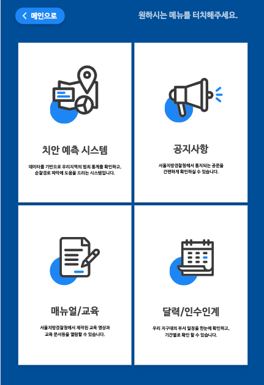
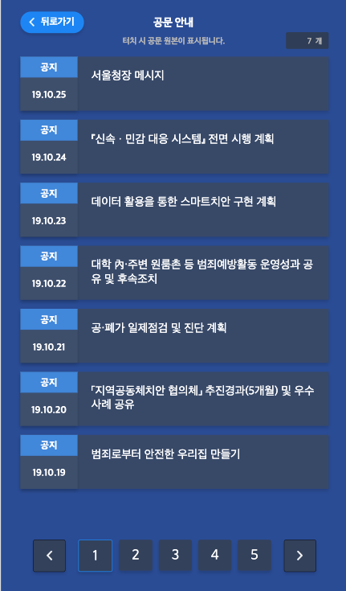
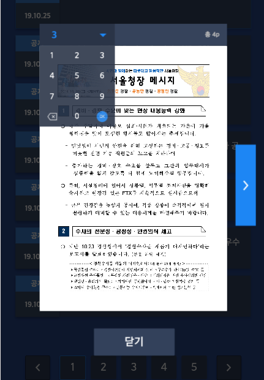
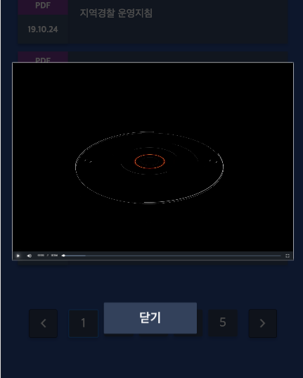

<br>
<br>

# 개요

<br>

**실내 실시간 공기질 측정 모니터링**프로젝트를 마치고 얼마 안 지나서 사내에서 진행하는 프로젝트에
투입되었다. 바로 **경찰청 키오스크**이다. 크게 4개의 메뉴로 나뉘는데 그 중 2개를 맡아서 하였다. 
공지사항, 매뉴얼/교육 메뉴인데 진행하면서 가장 핵심적인 기능은 **PDF**를 띄우는 일과 **Video**를 
재생하는 일이다. 또한 PDF는 한 페이지씩 보이며 **검색을 통해** 원하는 페이지로 바로 갈 수 있도록 하였다. 전부 처음하는 일이라 만만치 않은 작업이었다. 특히 **라이브러리**를 가져다 쓰는 일에서 수많은 시행착오를 겪으며 완성하였다.

<br>
<br>

# 기획

<br> 

* **화면은** 키오스크 해상도에 맞추어 모든 요소를 가변이 아닌 고정된 크기로 만든다.



* **공지사항** 메뉴에서 PDF를 컴포넌트 단위로 최대 7개만 화면에 보이도록 한다.
페이지네이션을 페이지를 나누고 초과되는 PDF는 오래된 순으로 다음 페이지에 추가된다.



* **PDF**를 클릭 할 시 Modal형태로 해당 파일에 첫 페이지가 보인다. 양 옆에 버튼을 추가하여 한 장씩 넘어갈수 있도록 하고 페이지를 검색하여 원하는 페이지로 바로 이동도 가능하다.



* **비디오**는 클릭 할 시 바로 재생이 되며 일시정지 및 원하는 시간으로 이동이 가능하다.



<br>
<br>

# 기술설계

<br>

* **Pagination**라이브러리를 활용해서 하단에 페이지네이션을 구현한다.

<br>

```renux
    npm install --save react-paginate
```

<br>

```jsx
    import ReactPaginate from 'react-paginate';

    <ReactPaginate
        pageLinkClassName={'linkpage'}     // 각각의 페이지요소에 <li> 태그 css 수정
        containerClassName={'pagination'}  // 페이지네이션 전체 컨테이너 css 수정
        activeClassName={'activepages'}    // 클릭하여 활성화 된 <li> 태그 css 수정
        activeLinkClassName={'activelink'} // 클릭하여 활성화 된 <a> 태그 css 수정
        pageRangeDisplayed={5}             // 화면에 보일 페이지 수 조정
        pageCount={this.state.current}     // 현재 화면에 활성화 할 페이지 설정
        previousLabel={                    // 이전으로 넘어가는 버튼 html 및 css
            <button className='preBtn'>
                
            </button>
        }
        nextLabel={                        // 다음으로 넘어가는 버튼 html 및 css
            <button className='nextBtn'>
                
            </button>
        }
    />
```

<br>

받아온 **Paginate API**를 해당 GitHub주소에서 어떻게 사용하고 내가 커스텀하기에 충분한 함수들이 구비되어있는지 확인한 후 필요한 함수를 사용해서 구현하였다. 

<br>

*참고링크 :* **https://github.com/AdeleD/react-paginate#readme**

* **PDF**라이브러리를 활용해서 PDF창을 띄우는 작업을 진행하였다.

<br>

```renux
    npm install --save react-pdf
```

<br>

```jsx
    import { Document, Page, pdfjs } from "react-pdf";

    //react-pdf을 최신버전으로 업데이트
    pdfjs.GlobalWorkerOptions.workerSrc = `//cdnjs.cloudflare.com/ajax/libs/pdf.js/${pdfjs.version}/pdf.worker.js`;

    <Document

        //활용 함수들

        file            // 활성화 할 PDF 설정
        onLoadSuccess   // PDF가 성공적으로 활성화 됬을 때 콜백되는 함수
        loading         // 로딩중일 때 콜백되는 함수
    >
        <Page

            //활용 함수들

            width   // 넓이 설정
            height  // 높이 설정
            loading // 로딩중일 때 콜백되는 함수
            noData  // 활성화 할 PDF가 없을 때 콜백되는 함수
            error   // "Failed to load the page."이 발생하면 콜백되는 함수
        />
    </Document>   
```

<br>

**사용한 PDF**라이브러리가 유지보수가 안되어 있어서 제작자가 이 API를 만들면서 사용한 **Mozilla**에서 제공하는 *javascript pdf*라이브러리가 최선버전이 아니었다. 이 때문에 화면에서 pdf의 화면이 모두 깨져서 나왔다. **node_modules**에서 이 라이브러리 폴더에 접근 후 원본을 수정하여 **Mozilla**에서 제공하는 *javascript pdf*라이브러리만 따로 최신버전으로 업데이트하는 작업을 진행하였다. 

<br>

*참고링크 :* **https://github.com/wojtekmaj/react-pdf#readme**

<br>

* **Video**라이브러리를 활용하여 영상 재생을 구현한다.

<br>

```renux
    npm install --save video-react
```

<br>

```jsx
    import {Player} from 'video-react';

    <Player
        autoPlay    // 영상 자동재생 여부 Type : boolean
        src         // 재생 할 비디오 설정
    />
```

<br>

**video-react 라이브러리** 해당 GitHub에 들어가서 필요한 함수 및 제공하는 컴포넌트를 활용해 구현하였다.  

<br>

*참고링크 :* **https://video-react.js.org/components/player/**

* **Dependancies**

```jsx
    "dependencies": {
        "video-react": "^0.14.1",
        "react-modal": "^3.10.1",
        "react-paginate": "^6.3.0",
        "react-pdf": "^4.1.0",
        "react-pdf-js": "^5.1.0",
        "@material-ui/core": "^4.5.0",
        "@react-pdf/renderer": "^1.6.6",
        "@react-pdf/styled-components": "^1.4.0",
        "rc-pagination": "^1.20.8",
    }
```
</br>


# 긴 글 읽어주셔서 감사합니다.
