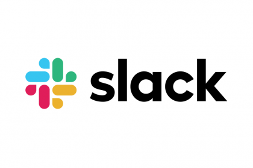

<br>
<br>

# 개요

<br>

**슬랙 봇**에 대해 알게되고 더 자세히 알아보려고 인터넷 서치를 하던 중 한 블로그에서 재밌는 글을 보았다. 내용을 간략히 정리하자면 
사내에서 슬랙 봇을 이용하여 **여러 문제들을 해결**하고 있다는 것이었다. 그 사례로는 서비스 내 용어가 팀별로 다르게 쓰이거나 여러가지로 
불리고 있어 신규 입사자나 전달이 안된 다른 팀과 소통할 때 오해가 생기게 되는데 이때 **슬랙 봇이 용어를 설명 및 교정** 해준다거나 
사내에 업무 일정이나 행사 등을 공지 하고 슬랙 봇에 업데이트 해서 당일 아침이나 전날 밤에 리마인드 해주는 기능으로 쓰이는 등이 있었다.
이 글을 보면서 나는 현재 회사 **출/퇴근 관리**가 슬랙 해당 채널에서 출/퇴근을 메세지로 치면 나중에 한 분이 그 메세지를 종합하여 직접 계산해서 문서화하는 방식으로 진행하고 있는데, 이 번거러움을 **슬랙 봇을 이용하면 해결**할 수 있겠다는 생각이 들어 기획하게 되었다.


**참고자료 링크 : https://spoqa.github.io/2017/05/22/slackbot.html**

<br>
<br>

# 기획

<br>

* **슬랙 해당 채널**에 *출근,퇴근,ㅌㄱ,ㅊㄱ* 등에 키워드를 슬랙 봇이 듣도록 설정한다. 텍스트를 입력했을 때 문장에 해당하는 키워드가 있을 경우
  그 문장을 작성한 유저에 필요한 정보를 가져온다.


* **데이터베이스**에 얻어온 정보를 분류하여 저장한다.


* **화면에 유저들을 배치하고** *저장된 데이터*를 이용하여 username으로 각각의 데이터를 분류하여 통계를 내고 뿌려준다.


* **자세히 보기**버튼을 만들어 클릭 시 *출근시간, 퇴근시간, 휴가/반차정보, 지각세부정보*에 자세한 정보를 볼 수 있도록 한다.


* **날짜 조회**기능을 도입하여 원하는 날짜만 검색해서 볼 수 있도록 한다.


<br>
<br>

# 기술 설계

<br>

* **create-react-app 폴더명**을 통해 작업환경이 준비가 되어있는 상태로 시작한다.이는 facebook에서 관리하는 React Boilerplate code이다. 따로 Boilerplate를 만들어 사용할 경우 버전 관리 및 업데이트에서 시간을 많이 소모해야되고 번거롭다. 당장에 **webpack, babel**은 리엑트를 할 때에 필요한 요소이기에 포함해야 되는데 이들을 세팅하는 일이 엄청 복잡하다. 하지만 **create-react-app** 명령어 하나면 모든게 해결된다.

```renux
    create-react-app slackbot
```

<br>

1. **슬랙 봇 연결** 채널에 추가한 슬랙 봇에 토큰을 받아와 연결.

Slack에 있는 API를 활용하기 위해서 먼저 설치를 한다.

```renux
    npm install --save @slack/client 
```
<br>

```jsx
//slack api
const {RTMClient, WebClient} = require('@slack/client');

// slack tokens
const token = process.env.SLACK_TOKEN;

// slack api connect slack token
const rtm = new RTMClient(token);
const web = new WebClient(token);

//생성한 rtm객체 실행
rtm.start();

//텍스트를 읽도록 event 등록 자세한 사항은 아래에 사이트 참조.
rtm.on(event(ex:'message'), function); 

//해당 유저에게 메세지를 보내는 event 등록 및 자세한 사항은 아래에 사이트 참조.
web.chat.postMessage 
```

<br>

**주석을 모두 읽어주세요**

**RTMClient와 WebClient**를 선언하고 token과 연결을 해줘야 되는데 여기서 **token은** 사전에 슬랙에서 생성한 슬랙 봇에 고유 번호이다. 이는 노출되서는 안되기에 .env에서 관리한다. 먼저 **rtm, web**으로 선언한 슬랙 API와 Token을 연결해서 생성한다. 그리고 생성된 객체를 실행해준다.

<br>

*참고링크 :* **https://api.slack.com/rtm, https://api.slack.com/web**

<br>

2. **Sequelize**를 사용한 데이터베이스 관리.    

**sequelize** 설치

```renux
    npm install --save sequelize
```

<br>

**데이터베이스 관리는** 모두 models폴더에서 따로 하였다. 필요한 테이블 파일을 생성하고 index파일에서 테이블을 합쳐 하나의 
DB로 만들어주는 구조로 설계하였다.

* models/goworks.js

```jsx
//define() => sequelize에서 테이블 생성해주는 기본 함수
module.exports = (sequelize, DataType)=>{
    const Gowork = sequelize.define("goworks",{
        name :{
            type : DataType.STRING,  //데이터 타입 설정 
            allowNull : false ,      //null값 허용 설정 Type : boolean
            
        },
        gowork:{
            type : DataType.STRING, 
            allowNull : false 
        },
        time : {
            type : DataType.STRING,
            allowNull : false
        },
        searchday : {
            type : DataType.STRING,
            allowNull : false
        }
        
    });
    
    return Gowork;
}
```
sequelize에서 제공하는 함수 중 **define 함수**를 통해 테이블을 생성하였다. **첫 번째 인자값**에 테이블 이름을 정의하고 **두 번째 인자값**에 테이블에서 사용할 Column을 정의해준다.

<br>

* models/index

```jsx
const fs = require("fs");//filesystem 불러옴
const path = require("path");//path 불러옴
require('dotenv').config();
const basename = path.basename(__filename);//path의 기본 폴더를 불러와서 세팅
const Sequelize = require("sequelize");//sequelize 불러옴

const db ={};//기본 db저장 객체 생성

//mysql sequealize 불러옴
const sequelize = new Sequelize("slackbot", "root", process.env.DB_PASSWORD, {host : "localhost", dialect: "mysql"});

//내 데이터베이스와 sequelize가 연결되었는지 확인.
sequelize.authenticate().then(()=>{
    console.log("연결성공");
}).catch(err=>{
    console.log("연결실패",err);
});

fs.readdirSync(__dirname).filter(file=>{ //readiireSync => 디렉토리 읽어옴, _dirname :현제 티렉토리에 있는 파일이름
    return (file.indexOf('.') !== 0) && (file !== basename) && (file.slice(-3) === ".js");
}).forEach(file =>{
    let model = sequelize["import"](path.join(__dirname, file));
    db[model.name] = model;
});


db.sequelize = sequelize;
db.Sequelize = Sequelize;

module.exports = db;

```

<br>

**주석을 모두 읽어주세요**

현재 폴더에 있는 **index**파일을 제외한 테이블이 정의된 모든 파일을 읽어와서 **sequelize**를 이용해 **하나의 DB**를 만들어 내보낸다.

<br>

*참고링크 :* **https://sequelize.org/**

3. **Dependancies**

```jsx
    "@slack/client": "^5.0.2",
    "@slack/web-api": "^5.2.1",
    "axios": "^0.19.0",
    "body-parser": "^1.19.0",
    "concurrently": "^5.0.0",
    "dotenv": "^8.2.0",
    "express": "^4.17.1",
    "moment": "^2.24.0",
    "mysql": "^2.17.1",
    "mysql2": "^1.7.0",
    "nodemon": "^1.19.4",
    "react-awesome-modal": "^2.0.5",
    "react-datepicker": "^2.10.0",
    "react-router-dom": "^5.1.2",
    "sequelize": "^5.21.1"
```

* ### Github 주소 
**https://github.com/YooSeok2/SlackBotHelfCommute.git**

<br>

# 긴 글 읽어주셔서 감사합니다.


